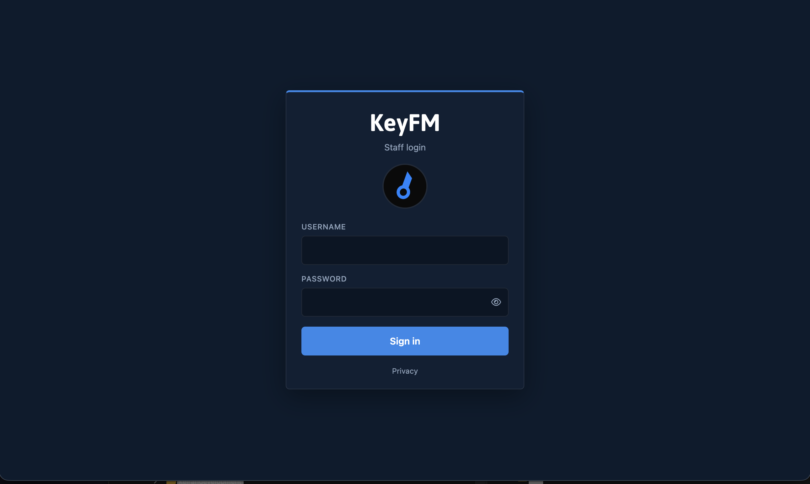
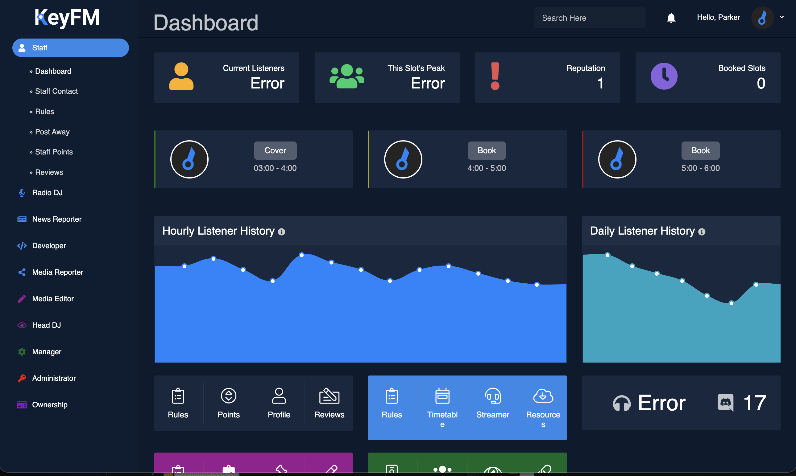

# Radio Panel

[](LICENSE)

Staff management panel for internet radio stations. Originally built for **KeyFM**.

**Original author:** [@ParkerSm1th](https://github.com/ParkerSm1th)  
**Modified by:** Keiran

UI based on the [Star Admin Free](https://www.bootstrapdash.com/product/star-admin-free/) Bootstrap template.

---

## Features

- Modular panel pages and permission ranks
- Post away, reviews, and staff reputation systems
- Like leaderboard and streamer panel
- Active users and panel logs
- Applications workflow and IP banning
- Short URL generation
- AzuraCast now-playing integration
- GDPR cookie consent and privacy page

---

## Screenshots

### Login



### Panel



---

## Requirements

- PHP 7.4+ (PHP 8.x supported)
- MySQL / MariaDB
- Apache with `mod_rewrite` (or equivalent routing)
- Optional: [AzuraCast](https://www.azuracast.com/) for live station stats

---

## Installation

### 1. Clone and configure

```bash
cp config/config.example.php config/config.php
```

Edit `config/config.php` with your database credentials and AzuraCast settings. Leave `url`, `app_path`, and `assets_path` as `auto` unless you need fixed URLs.

### 2. Create the database

```bash
mysql -u root -p -e "CREATE DATABASE panel_layout CHARACTER SET utf8mb4 COLLATE utf8mb4_general_ci;"
mysql -u root -p panel_layout < database/schema.sql
mysql -u root -p panel_layout < database/seed.sql
```

### 3. Web server

Point your document root at this folder (or install as a subdirectory e.g. `/Radio-Panel/`). Apache should read the included `.htaccess` for routing.

Ensure `storage/` and `profilePictures/` are writable — they are created automatically on first request.

### 4. Log in

| Field | Value |
|-------|-------|
| URL | `/` (or `/Radio-Panel/`) |
| Username | `admin` |
| Password | `Admin123@` |

Change this password immediately after first login.

---

## Database

The `database/` folder holds **SQL files for first-time setup only**. They are not used by the running panel — the app talks to MySQL through `config/config.php`.

| File | Purpose |
|------|---------|
| `database/schema.sql` | Creates all tables, indexes, and structure for a fresh install |
| `database/seed.sql` | Fills the empty database with starter data |

### What `schema.sql` does

Run this once on a new database. It creates every table the panel needs (users, timetable, notifications, nav ranks, panel pages, and the rest).

### What `seed.sql` does

Run this **after** `schema.sql` on a new install. It:

- Inserts the sidebar **nav ranks** (Staff, Radio, Manager, Admin, Dev, etc.)
- Inserts all **panel pages** linked to those ranks (Dashboard, Timetable, Staff list, and so on)
- Creates the default **admin** user (`admin` / `Admin123@`)

`seed.sql` uses `TRUNCATE` on `nav_ranks`, `panel_pages`, and `users` before inserting. **Do not run it on a live database** — it will wipe those tables and replace them with defaults.

### Production

After the database is set up, **remove the `database/` folder from production** (or keep it out of your deploy package).

- It is not required for day-to-day operation
- `seed.sql` contains the default admin password hash and would reset real data if imported again
- Keeping setup files on a public server adds unnecessary risk if web rules are ever misconfigured

`.htaccess` already blocks web access to `database/`, but deleting the folder on production is still recommended.

---

## URL structure

| Path | Description |
|------|-------------|
| `/` | Login |
| `/app` | Panel shell |
| `/app/Staff.Dashboard` | Bookmarkable page URL |
| `/api/{handler}` | API endpoints |
| `/logout` | Sign out |

Legacy `/panel/*` URLs redirect to `/app/*`.

---

## License

This project is open source under the **[MIT License](LICENSE)**.

You may use, copy, modify, and distribute it freely, provided the copyright notice and license text are included with any copy or substantial portion of the software.

Third-party assets (Star Admin template, Font Awesome, vendor libraries under `assets/` and `vendors/`) remain under their own licenses.

---

## Credits

- **Panel:** @ParkerSm1th — original KeyFM staff panel
- **Modified by:** Keiran — architecture refactor, routing, security, AzuraCast, UI updates
- **Template:** Star Admin Free by BootstrapDash
- **Icons:** Font Awesome

---

[]()
[]()
[]()
[]()
[]()
